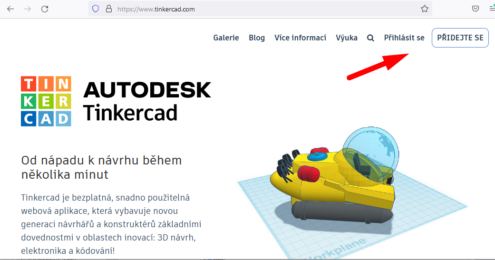
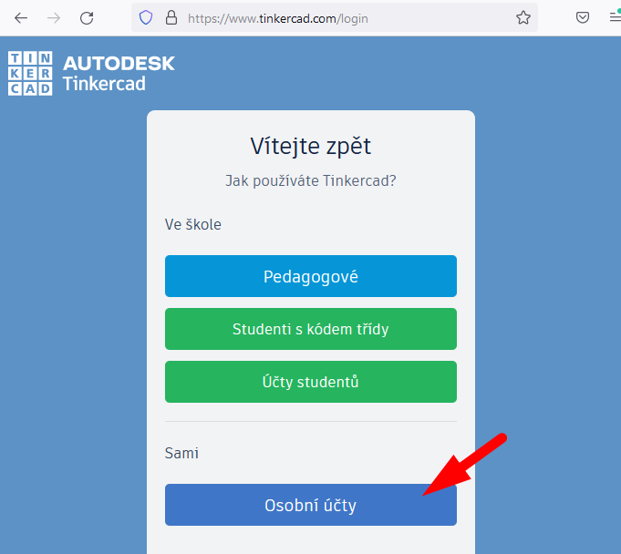
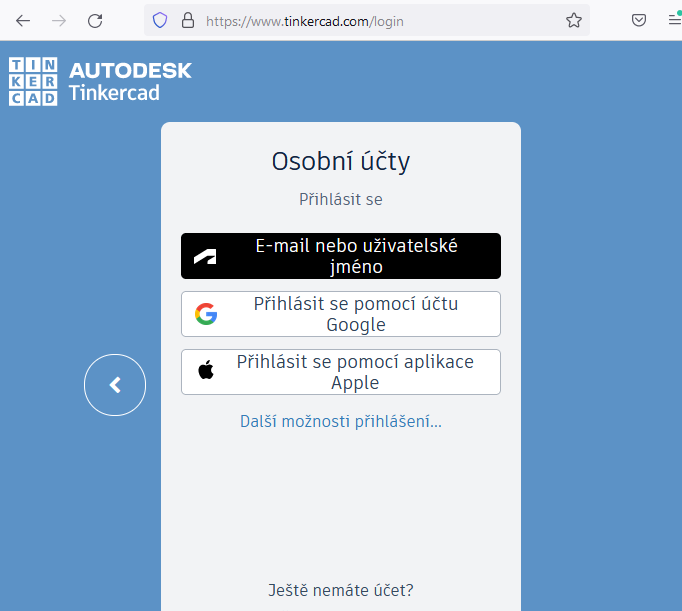
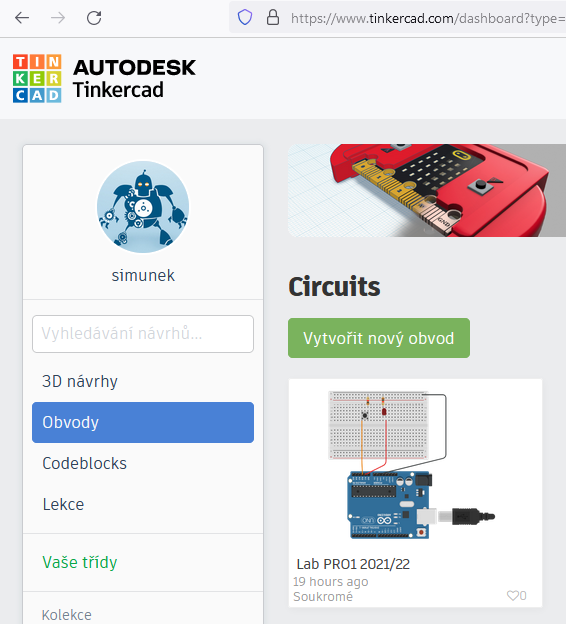
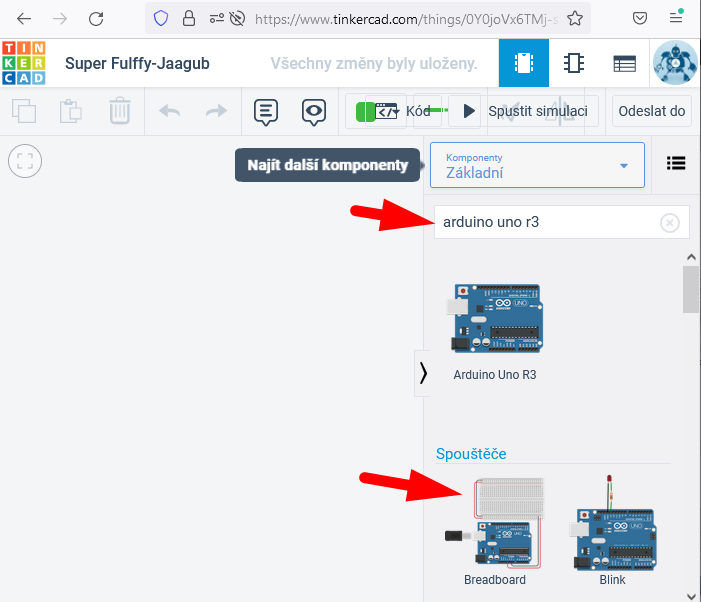
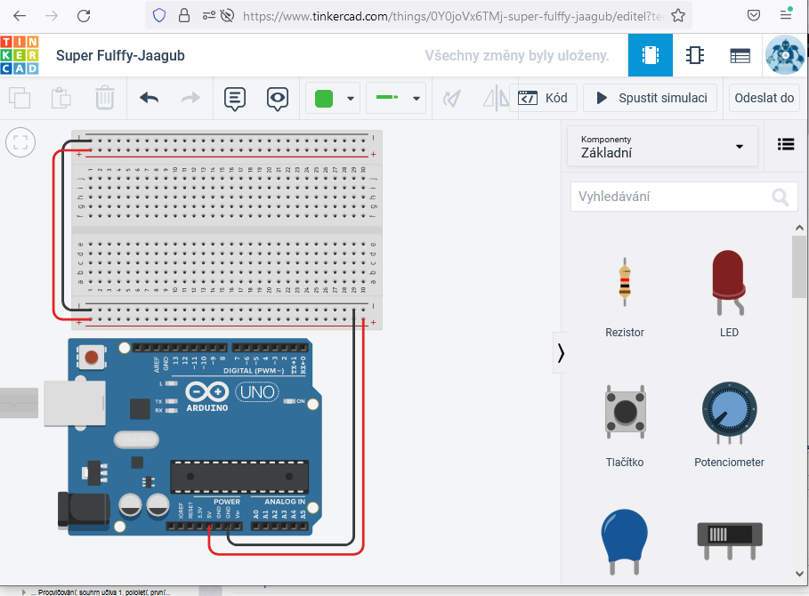
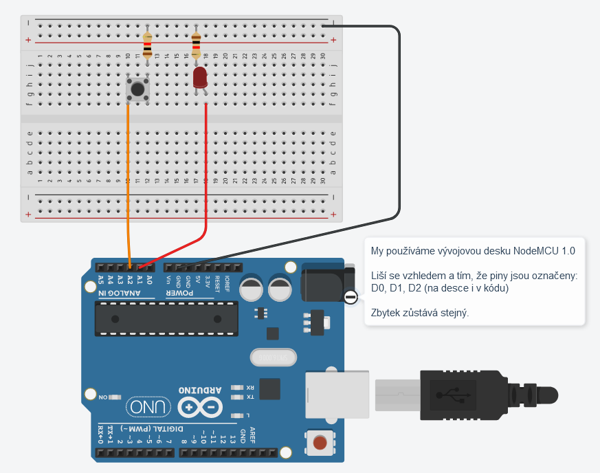
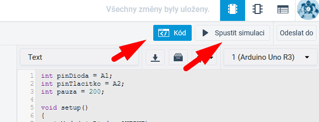
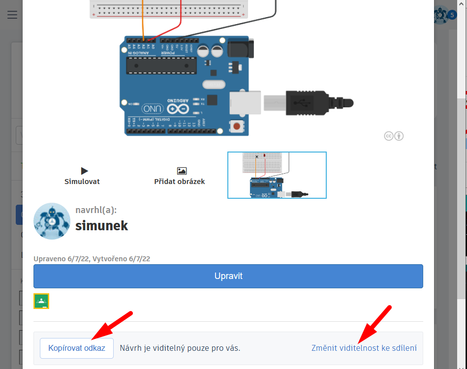

# Praktická úloha &mdash; čidlo vlhkosti a teploty DHT11

Na této stránce naleznete zadání úkolu zprovoznění čidla a teploty DHT11 s počítačem Arduino Uno. Úlohu využíváme v&nbsp;hodinách Praktického projektu na oboru Informační technologie na [Obchodní akademii, Vyšší odborné škole a Jazykové škole s&nbsp;právem státní jazykové zkoušky Uherské Hradiště](https://www.oauh.cz).

## Úkoly

1. Zprovoznit blikání jedné diody

2. Vytvořit „animovaný blinkr“ se třemi diodami

3. Zprovoznit čidlo teploty a vlhkosti DHT11/DHT22

4. Challenge: 
  - Když teplota na čidle přesáhne 22 °C, rozsviťte červenou diodu
  - Když vlhkost na čidle přesáhne 55 %, rozsviťte žlutou diodu  
    (Můžete nasimulovat tak, že na čidle podržíte prst &mdash; nedýchejte na něj!!!)
	

### Důležité:

> !!! Než připojíte elektřinu, ukažte zapojení učiteli!!!

### Další pravidla: 

- Použijte libovolné zdroje.
- Použijte stavebnici.

## Nastavení simulátoru TinkerCAD.com

Pro vyzkoušení můžete využít kromě hardwarového zařízení i simulátor na [TinkerCAD.com](https://www.tinkercad.com).

### Postup nastavení:

1. Přihlašte se nebo si vytvořte nový osobní účet  
 
1. Zvolte v&nbsp;levém menu záložku „Obvody“ 
1. Jako základ použijte zapojení Arduino Uno s breadboardem (nepájivým polem) 
 
1. Přetáhněte na plochu další prvky a vytvořte zapojení úlohy podle schématu: 

1. Přepněte se do záložky _Kód_. Zapište kód a spusťte simulaci! _Arduino Uno má vstupně/výstupní piny označeny `A0`, `A1`,... místo označení `D0`, `D1`,&hellip; u NodeMCU. Zbytek kód pro naše účely je stejný._ 

### Sdílení řešení:
1. Nastavte viditelnost a odešlete odkaz pro sdílení: 
    