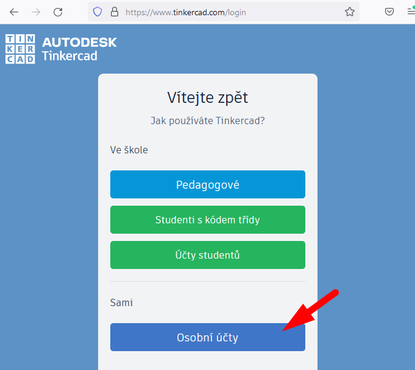

# Praktická úloha &mdash; programování NodeMCU 1.0

Na této stránce naleznete zapojení a postup nastavení pro práci s&nbsp;vývojovou deskou NodeMCU 1.0 v&nbsp;hodinách Programování 1 na oboru Informační technologie na [Obchodní akademii, Vyšší odborné škole a Jazykové škole s&nbsp;právem státní jazykové zkoušky Uherské Hradiště](https://www.oauh.cz).

## Schéma zapojení úlohy:


## Příprava prostředí ve škole
1. Ve škole můžete využít nainstalované vývojové prostředí Arduino IDE (pokud na dané učebně je nainstalované).
1. Je potřeba nainstalovat knihovny pro NodeMCU z&nbsp;disku `I:`
    - Spusťte:<br /> `i:\aplikace\Arduino-install\_krok2_extract-esp8266.bat`
    - Potvrďte přepsání všech souborů: `A`
    
    - Knihovny se instalují do vašeho lokálního účtu na konkrétním počítači — pokud sedíte na počítači poprvé, musíte je nainstalovat.

1. Připojte vývojovou desku.
1. V&nbsp;Arduino IDE zvolte port: obvykle je to `COM 3` nebo `COM 4`, ale může se lišit:
    

> Doma můžete využít návod pro instalaci zde:
> [&rarr; e-MiŠ.cz/ESP: Nastavení IDE](http://mis.e-mis.cz/index.php/ESP:_Nastaven%C3%AD_IDE)

## Kód pro čtení stavu tlačítka
Pro čtení stavu tlačítka v&nbsp;našem zapojení použijte:

```cpp
#define tlacitko D1
#define led D2

boolean stavTlacitka = HIGH; //tlačítko je na začátku nestisknuté
  
void setup() {
  pinMode(tlacitko, INPUT_PULLUP); //vstup - tlačítko
  pinMode(cervena, OUTPUT); //výstup - LED dioda
  }

void loop() {
  //uloží aktuální stav tlačítka - zjistí, zda je stisklé
  stavTlacitka = digitalRead(tlacitko);
  if(stavTlacitka == LOW) {
    // co se má stát, když bude tlačítko stisknuté?
  }
  delay(10);
}
```

## Nastavení simulátoru TinkerCAD.com

Pro vyzkoušení doma můžete využít simulátor na [TinkerCAD.com](https://www.tinkercad.com).

### Postup nastavení:

1. Přihlašte se nebo si vytvořte nový osobní účet<br /><br />
<br />
1. Zvolte v&nbsp;levém menu záložku „Obvody“<br />
1. Jako základ použijte zapojení Arduino Uno s breadboardem (nepájivým polem)<br />
<br />
1. Přetáhněte na plochu další prvky a vytvořte zapojení úlohy podle schématu:<br />

1. Přepněte se do záložky _Kód_. Zapište kód a spusťte simulaci!<br />_Arduino Uno má vstupně/výstupní piny označeny `A0`, `A1`,... místo označení `D0`, `D1`,&hellip; u NodeMCU. Zbytek kód pro naše účely je stejný._<br />

### Sdílení řešení:
1. Nastavte viditelnost a odešlete odkaz pro sdílení:<br />
    